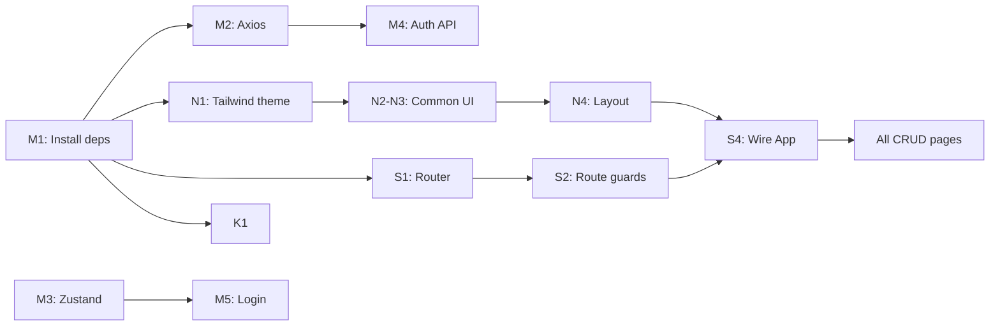

# Task Breakdown

# VaxTrack Frontend — Kanban Task Breakdown

> **Timeline:** March 9 – April 1, 2026 (23 working days, buffer before Apr 4 hard deadline)
**Team:** Minidu, Nethmi, Saniru, Kaveen
**Project:** VaxTrack Frontend (React + Vite + Tailwind + Zustand)
> 

---

## Sprint Overview

| Sprint | Dates | Focus |
| --- | --- | --- |
| **Sprint 1** | Mar 9 – Mar 15 | Foundation & project setup |
| **Sprint 2** | Mar 16 – Mar 23 | Core CRUD pages per member |
| **Sprint 3** | Mar 24 – Mar 29 | Advanced features & polish |
| **Sprint 4** | Mar 30 – Apr 1 | Testing, deployment, docs |

---

## 🔵 Minidu — Auth, Dependents, Vaccines, Batches, Inventory

| # | Task | Deadline | Dependencies |
| --- | --- | --- | --- |
| M1 | Install project dependencies (react-router-dom, axios, react-hot-toast, react-icons, react-hook-form, date-fns) | Mar 10 | — |
| M2 | Setup Axios instance with JWT interceptor | Mar 11 | M1 |
| M3 | Setup Zustand auth store (login, logout, localStorage persistence) | Mar 12 | M1 |
| M4 | Create auth API module (login, register, getProfile) | Mar 12 | M2 |
| M5 | Create Login page with form & validation | Mar 14 | M3, M4 |
| M6 | Create Register page with role selection & validation | Mar 15 | M3, M4 |
| M7 | Create Profile page | Mar 16 | M5 |
| M8 | Create Dependents CRUD page (list, add, edit, delete) | Mar 19 | M5 |
| M9 | Create Vaccines CRUD page with image upload | Mar 22 | M5 |
| M10 | Create Batches CRUD page with filters (status, vaccine, hospital) | Mar 25 | M9 |
| M11 | Create Inventory low-stock dashboard | Mar 27 | M10 |
| M12 | Write unit tests for auth & CRUD components | Mar 30 | M8–M11 |

---

## 🟢 Nethmi — Hospitals, Clinics, Layout

| # | Task | Deadline | Dependencies |
| --- | --- | --- | --- |
| N1 | Design Tailwind CSS theme & global styles (index.css with @theme tokens, color palette, typography) | Mar 11 | M1 |
| N2 | Create common UI components — Button, Card, Spinner, StatusBadge, EmptyState | Mar 13 | N1 |
| N3 | Create common UI components — Modal, ConfirmDialog, FormInput, FormSelect | Mar 14 | N1 |
| N4 | Create app layout — Sidebar (role-based nav), Navbar (user info, logout), responsive | Mar 15 | N1, N2 |
| N5 | Create NotFoundPage (404) | Mar 15 | N4 |
| N6 | Create Hospitals CRUD page (list, add, edit, delete, city/district filters) | Mar 20 | N4 |
| N7 | Create Clinics CRUD page with capacity indicator & schedule view | Mar 24 | N6 |
| N8 | Create Clinic capacity management UI (update capacity, overlap warnings) | Mar 26 | N7 |
| N9 | Integrate geocode display on hospital detail (show lat/long or map) | Mar 28 | N6 |
| N10 | Write unit tests for hospital & clinic components | Mar 30 | N6–N9 |

---

## 🟠 Saniru — Appointments, Queue, Routing

| # | Task | Deadline | Dependencies |
| --- | --- | --- | --- |
| S1 | Setup React Router — route definitions, public & protected routes | Mar 12 | M1 |
| S2 | Create ProtectedRoute & RoleRoute guard components | Mar 13 | S1, M3 |
| S3 | Create DashboardPage with role-based widgets (placeholder widgets) | Mar 15 | S2, N4 |
| S4 | Refactor App.jsx & main.jsx — wire router, layout, toast provider | Mar 15 | S1, N4 |
| S5 | Create common Table & Pagination components | Mar 16 | N2 |
| S6 | Create common SearchBar & filter bar components | Mar 17 | N2 |
| S7 | Create My Appointments page (list, cancel, QR display) | Mar 21 | S4 |
| S8 | Create Book Appointment page (browse clinics → select patient → confirm → QR) | Mar 25 | S7 |
| S9 | Create Queue Board page for staff (queue list, mark completed/no-show) | Mar 27 | S7 |
| S10 | Polish dashboard with real widgets (upcoming appointments, quick-book) | Mar 29 | S7–S9 |
| S11 | Write unit tests for appointment components | Mar 30 | S7–S9 |

---

## 🟣 Kaveen — Records, History, Side-Effects

| # | Task | Deadline | Dependencies |
| --- | --- | --- | --- |
| K1 | Create utility files — constants.js (roles, statuses, nav config) & formatters.js (date, phone) | Mar 12 | M1 |
| K2 | Create SeverityBadge component & other shared display components | Mar 14 | N2 |
| K3 | Create Records page — my records (Public) / all records table (Staff) with filters | Mar 20 | S4, N4 |
| K4 | Create Vaccination History page with grouped view (Self tab + Dependents tab) | Mar 24 | K3 |
| K5 | Create Due/Overdue vaccinations dashboard widget | Mar 26 | K3 |
| K6 | Create Side-Effects reporting page (report form + my reports list) | Mar 28 | K3 |
| K7 | Create Side-Effects admin view with severity filter | Mar 29 | K6 |
| K8 | Write unit tests for records & side-effect components | Mar 30 | K3–K7 |

---

## 🤝 Shared / Final Tasks (All Members)

| # | Task | Owner | Deadline | Dependencies |
| --- | --- | --- | --- | --- |
| F1 | Integration testing — full login → CRUD → logout flow | All | Mar 31 | All phases |
| F2 | Deploy backend to Render | Saniru | Mar 31 | — |
| F3 | Deploy frontend to Vercel/Netlify | Saniru | Mar 31 | F2 |
| F4 | Update README.md — setup instructions, deployment docs, env vars, live URLs | All | Apr 1 | F2, F3 |
| F5 | Git workflow cleanup — ensure meaningful commits, proper branches per member | All | Apr 1 | — |

---

## Sprint Timeline (Visual)

```
Week 1 (Mar 9-15)    ████████████████████████████████████████
  Minidu:  M1──M2──M3──M4──M5──M6
  Nethmi:  N1──────N2──N3──N4──N5
  Saniru:  S1──S2──────S3──S4
  Kaveen:  K1──────K2

Week 2 (Mar 16-23)   ████████████████████████████████████████
  Minidu:  M7──M8──────────M9
  Nethmi:  N6──────────────
  Saniru:  S5──S6──S7──────
  Kaveen:  K3──────────────

Week 3 (Mar 24-29)   ████████████████████████████████████████
  Minidu:  M10─────M11
  Nethmi:  N7──N8──────N9
  Saniru:  S8──────S9──────S10
  Kaveen:  K4──K5──────K6──K7

Week 4 (Mar 30-Apr 1) ██████████████████
  All:     Tests──Deploy──README
```

---

## Key Dependencies Summary

> [IMPORTANT]
**Sprint 1 blockers:** Everyone depends on M1 (dependency install) and N1 (Tailwind theme) being done first. Routing (S1, S2) and auth store (M3) are needed before any protected pages can be built.
> 

> [TIP]
**Parallel-safe from Sprint 2:** Once foundation is set (by Mar 15), all 4 members can work fully independently on their CRUD pages.
> 

